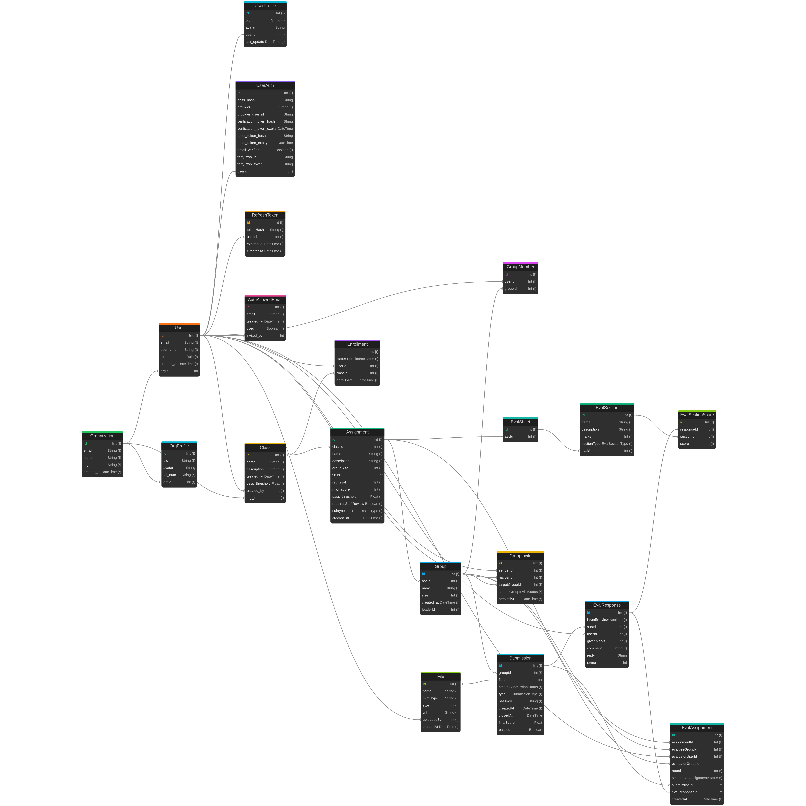

*This project has been created as part of the 42 curriculum by Yalnaani, Aruckenb, Aghanam, Pvass, and Karabitsc.*

# Transcendence: PeerPilot

---

# Table of Contents

* [Description](#description)
* [Team Information](#team-information)
* [Project Management](#project-management)
* [Technology Stack](#technology-stack)
* [Modules](#modules)
  * [Major Modules](#major-modules)
  * [Minor Modules](#minor-modules)
  * [Custom Modules](#custom-modules)
* [Features](#features)
* [Database Schema](#database-schema)
* [Instructions](#instructions)
  * [Requirements](#requirements)
  * [Getting Started](#getting-started)
  * [Commands](#commands)
  * [Project Structure](#project-structure)
  * [Architecture](#architecture)
  * [API Endpoints](#api-endpoints)
  * [Adding a New Service](#adding-a-new-service)
  * [Branch Strategy](#branch-strategy)
  * [Contributing](#contributing)
* [Journey](#journey)
* [Resources](#resources)

---

# Description

PeerPilot is a peer-to-peer learning platform inspired by the educational model of **42 School**. The platform enables students, instructors (Bocal), and administrators to collaborate through assignments, organizations, groups, and evaluations in a modern web application.

The project follows a **microservice architecture**, with an Angular frontend, Express.js backend services, a PostgreSQL database managed through Prisma ORM, and nginx acting as the reverse proxy. Everything is fully containerized using Docker for a simple development and deployment experience.

---

# Team Information

Developing **PeerPilot** was a collaborative effort involving five team members, each taking on a primary role while contributing across multiple areas of the project.

---

## Product Owner — Katrin Rabitsch (Karabitsc)

As the Product Owner, Katrin was responsible for defining the overall vision and direction of the project. She developed the original concept and continuously refined it by gathering feedback and feature suggestions from prospective users throughout development. One of her most significant contributions was designing and implementing the peer evaluation algorithm, which became a core feature of the platform. She also developed the evaluation system itself, contributed extensively to both the frontend and backend, and created the original `populateDB` script used to seed the database during development and testing. Her work ensured that the project remained focused on delivering a practical and engaging learning experience.

**Individual Contributions**
* Designed the overall educational workflow
* Implemented the complete peer evaluation system
* Designed and implemented the evaluation pairing algorithm
* Developed evaluation sheet creation and management
* Contributed to both frontend and backend development
* Created the original populateDB database seeding script
* Assisted with Prisma database design
* Helped develop REST API endpoints used by the evaluation service
* Participated in architectural planning and feature discussions

**Modules Primarily Worked On**
* ✔ Evaluation Pairing Algorithm (Custom Module)
* ✔ Public API Interacting with the Database
* ✔ ORM Database
* ✔ Framework for Frontend & Backend

**Challenges Faced**
*"The biggest challenge was learning everything from scratch while simultaneously designing the overall workflow. Building the evaluation process required balancing user experience, database design, and backend logic — all while continuing to learn new things throughout the project."*

---

## Project Manager — Albert Ruckenbauer (Aruckenb)

Albert served as the Project Manager, coordinating the team's development efforts from planning through delivery. He organized and chaired weekly meetings, documented discussions, assigned tasks, monitored project progress, and established milestones to keep development on schedule. Beyond managing the project, he contributed to frontend development by implementing the application's localization system, enabling multilingual support throughout the platform. He was also responsible for producing and maintaining the project's documentation, installation guides, and development resources, helping ensure that both users and developers could easily understand and work with the project.

**Individual Contributions**
* Planned and organized weekly development meetings
* Coordinated task allocation and milestone planning
* Managed project documentation
* Wrote installation and deployment documentation
* Designed and maintained the README and developer guides
* Implemented multilingual frontend localization
* Integrated language switching across the application
* Assisted with frontend development
* Contributed to testing and debugging
* Supported integration between frontend components
* Worked a little on the REST APIS

**Modules Primarily Worked On**
* ✔ Multi-language Support
* ✔ Framework for Frontend & Backend
* ✔ Cross-Browser Support
* ✔ Documentation and Project Management

**Challenges Faced**
*The sheer scope of the project and how much more complicated it was to implement certain features.*

---

## Technical Lead — Yamen Alnaani (Yalnaani)

Yamen acted as the Technical Lead and was the principal architect behind the project's technical design. He designed the overall microservice architecture and established the structure that allowed the backend services to communicate efficiently while remaining modular and maintainable. Throughout development, he worked extensively across both the backend and frontend, implementing numerous core features including the file upload system, REST APIs, user profile management, assignment and class functionality, reusable page layouts, and much of the application's overall frontend structure. His architectural decisions provided a scalable foundation that allowed the team to continue adding features without compromising maintainability.

**Individual Contributions**
* Designed the complete microservice architecture
* Implemented shared backend packages
* Developed REST API infrastructure
* Implemented the file upload system using MinIO
* Built reusable Angular components
* Designed the frontend design system
* Implemented user profile management
* Developed organizations and class management
* Created assignment workflows
* Implemented reusable page layouts
* Developed shared utility packages
* Implemented RTL language support
* Assisted with authentication
* Contributed extensively to database schema design
* Integrated Docker-based service architecture

**Modules Primarily Worked On**
* ✔ Backend as Microservices
* ✔ Framework for Frontend & Backend
* ✔ Organization System
* ✔ File Upload & Management
* ✔ Custom Design System
* ✔ Right-to-Left Support
* ✔ Public API Interacting with the Database

**Challenges Faced**
*The most complex part was designing the end-to-end flow for Bocal users — creating classes and assignments — and then threading that through to the student experience, including the full evaluation journey. Getting all those moving parts to work together cleanly was the hardest problem to solve.*

---

## Developer — Adam Ghanam (Aghanam)

Adam specialized in the authentication and security components of the platform. He designed and implemented the complete authentication workflow across both the frontend and backend, including user registration, secure login, JWT-based authentication, password hashing, session management, and email verification. In addition, he integrated third-party authentication providers such as GitHub and Google through OAuth, allowing users to securely access the platform using existing accounts. His work established a secure authentication system that serves as one of the project's fundamental components.

**Individual Contributions**
* Implemented user registration
* Developed secure login system
* Implemented JWT authentication
* Added refresh token rotation
* Developed password hashing
* Implemented password reset functionality
* Added email verification
* Integrated GitHub OAuth
* Integrated Google OAuth
* Built authentication middleware
* Protected backend API routes
* Assisted with frontend authentication flows
* Assisted with Arabic localization

**Modules Primarily Worked On**
* ✔ Standard User Management & Authentication
* ✔ OAuth 2.0 Authentication
* ✔ Public API Interacting with the Database
* ✔ Framework for Frontend & Backend

**Challenges Faced**
*Nothing Really*

---

## Developer — Peter Vass (Pvass)

Peter contributed across nearly every area of the project, making him one of the team's most versatile developers. On the backend, he helped design the PostgreSQL database structure and created the Entity Relationship Diagram used to document the application's database schema. He also contributed to the development of the `populateDB` script used during testing and development. On the frontend, he implemented the organization management interface, developed the progress dashboard, translated the application into Hungarian as part of the localization effort, and created several reusable user interface components. His broad contributions across both the frontend and backend helped ensure the platform remained consistent, well-structured, and easy to extend.

**Individual Contributions**
* Designed large portions of the Prisma database schema
* Produced the Entity Relationship Diagram
* Extended and maintained populateDB
* Developed organization management pages
* Built the student progress subtab
* Created reusable Angular components
* Implemented frontend search functionality
* Added Hungarian translations
* Assisted with API development
* Contributed to frontend integration and testing

**Modules Primarily Worked On**
* ✔ Organization System
* ✔ ORM Database
* ✔ Advanced Search
* ✔ User Activity Dashboard
* ✔ Multi-language Support

**Challenges Faced**
*The entire project was a challenge*

---

# Project Management

Throughout development the team used three main tools to coordinate work:

**GitHub** was used to manage the overall project. Changes were pushed to separate branches, reviewed in person during weekly meetings, and merged into the development branch. Conflicts were resolved in person.

**Trello** was used to assign tasks and break down work into clear, trackable items for each team member.

**Discord** served as the primary communication platform for:
* Planning weekly meetings
* Assigning tasks
* Discussing bugs
* Sharing development progress
* Planning milestones
* Sharing resources

---

# Technology Stack

| Layer            | Technology               |
| ---------------- | ------------------------ |
| Frontend         | Angular 17               |
| Backend          | Express.js Microservices |
| Database         | PostgreSQL 16            |
| ORM              | Prisma v5                |
| Reverse Proxy    | nginx                    |
| Containerization | Docker & Docker Compose  |
| Authentication   | JWT + OAuth 2.0          |
| File Storage     | MinIO                    |
| Localization     | ngx-translate            |

### Why These Technologies?

**Angular** was chosen for its scalability, component-based architecture, strong TypeScript integration, and built-in tooling. The project makes heavy use of Angular signals, computed values, and the standalone component pattern introduced in Angular 17.

**Express.js Microservices** allow each domain (users, auth, organizations, classes, enrollments, groups, submissions, evaluations) to evolve independently. Services share common packages for the database client, structured logging, error classes, and read-only query utilities, keeping each service thin and focused on its own business logic.

**PostgreSQL** provides reliable relational storage with strong support for transactions, cascading deletes, and complex joins — all of which are used extensively across the Prisma schema.

**Prisma ORM** drives all database access. A single `schema.prisma` file defines every model across all services, migrations are tracked in version control, and the generated client provides full TypeScript type safety.

**MinIO** is used as an S3-compatible object store for user avatars, assignment subject files, and student submission files. A shared `packages/fileManager` package wraps the MinIO client and Multer uploader so every service that needs file handling uses the same interface.

**Docker** ensures every developer runs an identical environment. The `Makefile` automates environment generation, database health-gating, migration deployment, and service startup so a fresh clone is a single `make` command away.

---

# Modules

The project fulfills several **Major** and **Minor** modules from the **42 ft_transcendence** curriculum. Each selected module was chosen to strengthen the platform's architecture, improve the user experience, and expose the team to modern full-stack development practices. Rather than implementing the minimum required functionality, the team focused on designing reusable, maintainable, and scalable solutions that integrate seamlessly with one another throughout the application.

## Module Summary

| Module                               | Type   | Points | Primary Contributors        |
| ------------------------------------ | ------ | :----: | --------------------------- |
| Framework for Frontend & Backend     | Major  |   2    | Everyone                    |
| Public API Interacting with Database | Major  |   2    | Yamen, Adam, Katrin, Albert |
| Standard User Management             | Major  |   2    | Adam, Yamen                 |
| Advanced Permission System           | Major  |   2    | Yamen, Peter                |
| Organization System                  | Major  |   2    | Peter, Yamen                |
| Backend as Microservices             | Major  |   2    | Yamen                       |
| ORM Database                         | Minor  |   1    | Peter, Yamen, Katrin        |
| Real-Time Collaborative Features     | Minor  |   1    | Everyone                    |
| Custom Design System                 | Minor  |   1    | Yamen                       |
| Advanced Search                      | Minor  |   1    | Peter, Yamen                |
| File Upload & Management             | Minor  |   1    | Yamen                       |
| Multi-language Support               | Minor  |   1    | Albert, Peter, Adam, Yamen  |
| Right-to-Left Support                | Minor  |   1    | Yamen                       |
| Cross-Browser Support                | Minor  |   1    | Everyone                    |
| OAuth 2.0 Authentication             | Minor  |   1    | Adam                        |
| User Activity Dashboard              | Minor  |   1    | Peter, Yamen                |
| Evaluation Pairing Algorithm         | Custom |   1    | Katrin                      |

---

# Major Modules

*Total: 12 Points*

## ✔ Framework for Frontend and Backend (2 Points)

The frontend is a single-page Angular 17 application using standalone components, the new signals API, and `@ngx-translate/core` for internationalization. It communicates with the backend exclusively through the nginx reverse proxy, which routes `/api/*` paths to the appropriate microservice. The backend is a set of Express.js services, each built from a shared template: an Express app, a `/health` endpoint, a central error handler using the shared `errors` package, and structured JSON logging via the shared `logger` package.

**Primary Contributors:** *Entire Team*

---

## ✔ Public API Interacting with the Database (2 Points)

Every service exposes a REST API for CRUD operations on its domain. The user service manages user accounts and profiles. The organization service handles organizations, membership, and org profiles. The class service owns classes, assignments, and their associated evaluation sheets. The enrollment service manages the student–class relationship. The group service handles assignment groups and peer invitations. The submission service manages file uploads to MinIO and submission lifecycle. The evaluation service drives the eval sheet, pairing algorithm, and scoring flow. All services share a single Prisma client generated from one central schema.

**Primary Contributors:** *Yamen, Adam, Katrin, Albert*

---

## ✔ Standard User Management & Authentication (2 Points)

Authentication is handled by a dedicated auth service. Registration requires an invited email address (stored in `auth_allowed_emails`), a strong password validated by `zxcvbn`, and email verification before the account can be used. Login issues a short-lived JWT access token (default 15 minutes) and a long-lived refresh token stored as a hashed value in the database and delivered via an httpOnly cookie. The Angular `AuthInterceptor` attaches the Bearer token to every outgoing request and transparently refreshes it on 401 responses using a queued retry mechanism.

**Primary Contributors:** *Adam, Yamen*

---

## ✔ Advanced Permission System (2 Points)

Three roles — Student, Bocal, and Admin — gate access throughout both the backend and frontend. On the backend, the auth middleware's `requireRole` helper fetches the user's current role from the database and enforces it per route. On the frontend, Angular route guards (`authGuard`, `bocalGuard`, `adminGuard`) protect sections of the application, and the sidebar dynamically filters navigation items by role. Bocal users see the class management and evaluation pairing panels; Admin users additionally see the organization and whitelist management screens.

**Primary Contributors:** *Yamen, Peter*

---

## ✔ Organization System (2 Points)

Organizations are the top-level grouping entity. An organization has an email, name, tag, and an optional profile (bio, phone number, avatar). Users belong to at most one organization and carry a role scoped to that organization. Bocal users manage classes and students within their organization. Admins can create and delete organizations, manage the allowed-email whitelist, and invite or revoke users across the platform. The org service exposes endpoints for member management, profile management, and fetching the org's classes.

**Primary Contributors:** *Peter, Yamen, Katrin*

---

## ✔ Backend as Microservices (2 Points)

The backend is split into eight independent services: `user` (port 3001), `auth` (port 3002), `org` (port 3003), `class` (port 3004), `enroll` (port 3005), `group` (port 3006), `submission` (port 3007), and `eval` (port 3008). Each service is built and run as its own Docker container. They share three internal Docker networks: `database-network` (services to PostgreSQL), `backend-network` (nginx to services), and `frontend-network` (nginx to the Angular container). Services never talk directly to each other; all cross-service data needs are resolved by the frontend or by the shared `packages/utils` read-only query helpers.

**Primary Contributors:** *Yamen*

---

# Minor Modules

*Total: 11 Points*

## ✔ ORM Database (1 Point)

All database access goes through Prisma v5. A single `schema.prisma` in `packages/database` defines every model — User, Organization, Class, Assignment, Enrollment, Group, Submission, EvalSheet, EvalSection, EvalResponse, EvalAssignment, GroupInvite, RefreshToken, AuthAllowedEmail, and more. Migrations are generated locally with `prisma migrate dev` and applied in Docker with `prisma migrate deploy`. The `packages/database/index.js` exports a singleton `PrismaClient` instance required by every service via relative path.

**Primary Contributors:** *Peter, Yamen, Katrin*

---

## ✔ Real-Time Collaborative Features (1 Point)

Students collaborate on assignments through a group system. A student creates or joins a group for an assignment, and the group leader can invite other enrolled students by sending a `groupInvite` record. Invitees see pending invitations on their assignment detail page and can accept or decline. All group members share a single submission, and the group leader is the one who closes it and receives evaluator feedback, to which they can reply. The reply triggers a `finalScore` recomputation averaged over all replied-to evaluations.

**Primary Contributors:** *Entire Team*

---

## ✔ Custom Design System (1 Point)

The frontend uses a bespoke design system defined in `src/tokens.ts` and `src/colors_and_type.css`. It provides typed TypeScript constants for all colors (using OKLCH color space), typography scales (Space Grotesk for display, DM Sans for body, JetBrains Mono for code), spacing, border radius, and shadow tokens. Reusable Angular components — `BtnComponent`, `BadgeComponent`, `ContainerComponent`, `ListComponent`, `ProgressBarComponent`, `ScorePillComponent`, `FieldComponent`, `AvatarComponent`, and `SidebarComponent` — are all built from these tokens, ensuring visual consistency across every screen.

**Primary Contributors:** *Yamen*

---

## ✔ Advanced Search (1 Point)

The `packages/utils` shared query helpers provide flexible search across entities. `searchUser` accepts email and/or username and constructs an OR filter. `searchOrg` accepts email and/or name. These are used throughout the org service (duplicate detection on member add, user lookup on removal) and the auth service (email lookup on login and registration).

**Primary Contributors:** *Peter, Yamen*

---

## ✔ File Upload & Management (1 Point)

File handling is centralized in `packages/fileManager`, which wraps `multer` (memory storage, 50 MB limit, MIME type allowlist) and the MinIO client. It exposes `uploader` for route middleware and `createStorage(bucket)` for per-bucket upload, presigned URL generation, public URL generation, and deletion. Three separate MinIO buckets are used in production: `user-profile` for avatars, `assignment-subjects` for Bocal-uploaded subject PDFs, and `submissions` for student submission files.

**Primary Contributors:** *Yamen*

---

## ✔ Multi-language Support (1 Point)

The application supports four locales: English (`en`), German (`de`), Hungarian (`hu`), and Arabic (`ar`). Translation files live in `src/frontend/src/app/languages/`. `@ngx-translate/core` is configured with a custom `MissingTranslationHandler` that falls back to the English value for any key missing in the active language, so partial translations never show raw keys to users. The language selection is persisted to `localStorage` and applied on startup.

**Primary Contributors:** *Albert, Peter, Adam, Yamen*

---

## ✔ Right-to-Left (RTL) Support (1 Point)

When Arabic is selected, `document.documentElement.dir` is set to `rtl` and `document.documentElement.lang` to `ar`. This is done both in the `APP_INITIALIZER` on startup and immediately in the language switcher component on language change. The CSS custom properties and flex-based layout respond correctly to the RTL direction without additional overrides.

**Primary Contributors:** *Yamen*

---

## ✔ Cross-Browser Support (1 Point)

The Angular application targets ES2022 and uses standard Web APIs. The landing page animation system is carefully guarded against Angular Material's zone.js interference, using `!important` on transition durations, double `requestAnimationFrame` delays before starting scroll-triggered animations, and `NgZone.runOutsideAngular` to prevent change-detection cycles from interrupting CSS transitions.

**Primary Contributors:** *Entire Team*

---

## ✔ OAuth 2.0 Authentication (1 Point)

GitHub and Google OAuth flows are implemented in the auth service. Both use a `state` cookie for CSRF protection. On successful OAuth callback the service finds or creates a user (checking the allowed-email list for new accounts), issues access and refresh tokens, sets the refresh cookie, and redirects to the Angular `OAuthCallbackComponent` with the access token in the URL fragment. The Angular `AuthService.handleOAuthCallback()` extracts the token and calls `getMe()` to complete the session.

**Primary Contributors:** *Adam*

---

## ✔ User Activity Dashboard (1 Point)

The dashboard aggregates data from multiple backend APIs. It fetches the user's enrolled classes and their assignments via the enroll service, then enriches each assignment with submission data from the submission service to derive live status badges and scores. Four stat tiles display average completion score, assignment progress, evaluations given, and pending reviews. The "Recent assignments" panel links directly to assignment detail pages. All labels and stat subtitles are translated through ngx-translate.

**Primary Contributors:** *Peter, Yamen*

---

# Custom Modules

## ✔ Evaluation Pairing Algorithm (1 Point)

The evaluation pairing system (`eval.service.js → generateSimpleEvalAssignmentPairings`) automatically assigns peer evaluators to every group for a given assignment. Groups are first sorted by ID for determinism, then shuffled using a seeded LCG random function keyed to the assignment ID, ensuring the same assignment always produces the same schedule regardless of database return order. The algorithm generates circular offset pairings across rounds: in round `r`, group `i` is evaluated by the group at position `(i + r) % n`. This guarantees no group evaluates itself and every group receives exactly `req_eval` evaluations. The evaluator user within each group is rotated across rounds. The algorithm validates that enough groups exist for the required number of rounds and surfaces a clear error message if not. Bocal users can also manually edit, delete, or regenerate pairings from the eval assignment list page.

**Primary Contributors:** *Katrin*

---

# Features

Transcendence is designed as a complete peer-to-peer learning platform that supports students, instructors (Bocal), and administrators throughout the entire educational workflow. The application combines user management, organizations, assignments, collaborative group work, peer evaluations, file management, multilingual support, and analytics into a single integrated platform.

The features below are grouped by functionality and user role.

---

## Platform Overview

| Feature                      | Student | Bocal | Admin |
| ---------------------------- | :-----: | :---: | :---: |
| Dashboard                    |    ✓    |   ✓   |   ✓   |
| Manage Profile               |    ✓    |   ✓   |   ✓   |
| Join Organizations           |    ✓    |   ✓   |   ✓   |
| Enroll in Classes            |    ✓    |   ✓   |   ✓   |
| Submit Assignments           |    ✓    |       |       |
| Create Groups                |    ✓    |       |       |
| Peer Evaluations             |    ✓    |       |       |
| Manage Classes               |         |   ✓   |       |
| Create Assignments           |         |   ✓   |       |
| Generate Evaluation Pairings |         |   ✓   |       |
| View Student Progress        |         |   ✓   |       |
| Create Organizations         |         |       |   ✓   |
| Invite Users                 |         |   ✓   |   ✓   |
| Manage Permissions           |         |       |   ✓   |
| Organization Management      |         |       |   ✓   |

---

## Feature — Contributor Matrix

The table below maps each platform feature to the team member(s) who primarily built or led its implementation.

| Feature Area                              | Katrin (Karabitsc) | Albert (Aruckenb) | Yamen (Yalnaani) | Adam (Aghanam) | Peter (Pvass) |
| ----------------------------------------- | :----------------: | :---------------: | :--------------: | :------------: | :-----------: |
| **Standard User Management**              |                    |                   |        ✓         |       ✓        |               |
| — Invited-Email Registration Flow         |                    |                   |                  |       ✓        |               |
| — Password Strength (zxcvbn)              |                    |                   |                  |       ✓        |               |
| — Angular AuthInterceptor                 |                    |                   |        ✓         |       ✓        |               |
| **User Authentication**                   |                    |                   |        ✓         |       ✓        |               |
| — JWT & Refresh Tokens                    |                    |                   |                  |       ✓        |               |
| — OAuth 2.0 (GitHub & Google)             |                    |                   |                  |       ✓        |               |
| — Email Verification & Password Reset     |                    |                   |                  |       ✓        |               |
| — Auth Middleware & Route Protection      |                    |                   |        ✓         |       ✓        |               |
| **Advanced Permission System**            |                    |                   |        ✓         |                |       ✓       |
| — `requireRole` Backend Middleware        |                    |                   |        ✓         |       ✓        |               |
| — Angular Route Guards (auth/bocal/admin) |                    |                   |        ✓         |                |       ✓       |
| — Role-Filtered Sidebar Navigation        |                    |                   |        ✓         |                |       ✓       |
| **User Profiles**                         |                    |                   |        ✓         |                |               |
| — Avatar Uploads (MinIO)                  |                    |                   |        ✓         |                |               |
| — Profile Editing                         |                    |                   |        ✓         |                |               |
| **Organization Management**               |                    |                   |        ✓         |                |       ✓       |
| — Org Creation & Profiles                 |                    |                   |        ✓         |                |       ✓       |
| — Member Management & Invitations         |        ✓           |                   |        ✓         |                |       ✓       |
| — Email Whitelist Management              |                    |                   |                  |       ✓        |               |
| **Class Management**                      |                    |                   |        ✓         |                |       ✓       |
| — Create / Edit / Delete Classes          |                    |                   |        ✓         |                |               |
| — Student Enrollment                      |                    |                   |        ✓         |                |       ✓       |
| **Assignment Management**                 |        ✓           |                   |        ✓         |                |               |
| — Assignment Creation & Editing           |                    |                   |        ✓         |                |               |
| — Subject File Uploads                    |                    |                   |        ✓         |                |               |
| — Evaluation Sheet Configuration          |        ✓           |                   |                  |                |               |
| **Real-Time Collaborative Features**      |        ✓           |       ✓           |        ✓         |       ✓        |       ✓       |
| — Group Invite & Accept / Decline Flow    |                    |                   |        ✓         |                |       ✓       |
| — Shared Group Submission                 |        ✓           |                   |        ✓         |                |               |
| — Six-Digit Passkey System                |        ✓           |                   |        ✓         |                |               |
| — Final Score Averaged Across Replies     |        ✓           |                   |                  |                |               |
| **Group Collaboration**                   |        ✓           |                   |        ✓         |                |       ✓       |
| — Group Creation & Invitations            |                    |                   |        ✓         |                |       ✓       |
| — Group Leader Permissions                |        ✓           |                   |        ✓         |                |               |
| **Submission System**                     |        ✓           |                   |        ✓         |                |               |
| — File Upload & MinIO Storage             |                    |                   |        ✓         |                |               |
| — Submission Locking & History            |        ✓           |                   |        ✓         |                |               |
| **Peer Evaluation**                       |        ✓           |                   |        ✓         |                |               |
| — Evaluation Pairing Algorithm            |        ✓           |                   |                  |                |               |
| — Evaluation Sheet Scoring Flow           |        ✓           |                   |        ✓         |                |               |
| — Feedback & Reply System                 |        ✓           |                   |        ✓         |                |               |
| — Final Score Computation                 |        ✓           |                   |                  |                |               |
| **Dashboards**                            |                    |                   |        ✓         |                |       ✓       |
| — Student Dashboard                       |                    |                   |        ✓         |                |       ✓       |
| — Bocal / Admin Panels                    |                    |                   |        ✓         |                |               |
| — Student Progress Subtab                 |                    |                   |                  |                |       ✓       |
| **Search & Filtering**                    |                    |                   |        ✓         |                |       ✓       |
| — User & Org Search Helpers               |                    |                   |        ✓         |                |       ✓       |
| — Frontend Search UI                      |                    |                   |                  |                |       ✓       |
| **REST API**                              |        ✓           |       ✓           |        ✓         |       ✓        |       ✓       |
| — User Service (`/api/user/`)             |                    |       ✓           |        ✓         |                |               |
| — Auth Service (`/api/auth/`)             |                    |                   |                  |       ✓        |               |
| — Org Service (`/api/org/`)               |        ✓           |                   |        ✓         |                |       ✓       |
| — Class Service (`/api/class/`)           |                    |                   |        ✓         |                |               |
| — Enroll Service (`/api/enroll/`)         |                    |                   |        ✓         |                |       ✓       |
| — Group Service (`/api/group/`)           |                    |       ✓           |        ✓         |                |       ✓       |
| — Submission Service (`/api/submission/`) |        ✓           |                   |        ✓         |                |               |
| — Eval Service (`/api/eval/`)             |        ✓           |                   |        ✓         |                |               |
| **File Management (MinIO)**               |                    |                   |        ✓         |                |               |
| — Shared fileManager Package              |                    |                   |        ✓         |                |               |
| — Presigned URL Generation                |                    |                   |        ✓         |                |               |
| **Internationalization**                  |                    |       ✓           |        ✓         |       ✓        |       ✓       |
| — English & German Translations           |                    |       ✓           |        ✓         |                |               |
| — Hungarian Translation                   |                    |                   |                  |                |       ✓       |
| — Arabic Translation                      |                    |       ✓           |                  |       ✓        |               |
| — Language Switcher & Persistence         |                    |       ✓           |        ✓         |                |               |
| — RTL Layout Support                      |                    |                   |        ✓         |                |               |
| **Security**                              |                    |                   |        ✓         |       ✓        |               |
| — HTTP-only Cookies & Token Rotation      |                    |                   |                  |       ✓        |               |
| — Input Validation & API Protection       |                    |                   |        ✓         |       ✓        |               |
| **Design System & UI Components**         |                    |                   |        ✓         |                |       ✓       |
| — Custom Token System (OKLCH)             |                    |                   |        ✓         |                |               |
| — Reusable Angular Components             |                    |                   |        ✓         |                |       ✓       |
| — Cross-Browser Compatibility             |                    |       ✓           |        ✓         |       ✓        |       ✓       |
| **Backend as Microservices**              |                    |                   |        ✓         |                |               |
| — 8 Independent Docker Services           |                    |                   |        ✓         |                |               |
| — Internal Docker Network Isolation       |                    |                   |        ✓         |                |               |
| — Shared `packages/utils` Query Helpers   |                    |                   |        ✓         |                |       ✓       |
| — Service-to-Service Boundary Design      |                    |                   |        ✓         |                |               |
| **Architecture & Infrastructure**         |                    |                   |        ✓         |                |               |
| — Microservice Architecture Design        |                    |                   |        ✓         |                |               |
| — Docker & Docker Compose Setup           |                    |                   |        ✓         |                |               |
| — Shared Backend Packages                 |                    |                   |        ✓         |                |               |
| — nginx Reverse Proxy Config              |                    |                   |        ✓         |                |               |
| **Database**                              |        ✓           |                   |        ✓         |                |       ✓       |
| — Prisma Schema Design                    |        ✓           |                   |        ✓         |                |       ✓       |
| — Entity Relationship Diagram             |                    |                   |                  |                |       ✓       |
| — Database Seeding (populateDB)           |        ✓           |                   |                  |                |       ✓       |
| **Documentation & Project Management**    |                    |       ✓           |                  |                |               |
| — README & Developer Guides               |                    |       ✓           |                  |                |               |
| — Meeting Coordination & Milestones       |                    |       ✓           |                  |                |               |
| — Task Assignment (Trello)                |                    |       ✓           |                  |                |               |

---

# Database Schema

The project uses Prisma v5 for schema management. The schema is defined in `src/packages/database/prisma/schema.prisma`.

The Entity Relationship Diagram below shows how the database is structured and how its models connect. For a live view of the data in any running instance, run:

```
make studio
```

This opens Prisma Studio at `http://localhost:5555`. Note that the project must be running first.



---

# Instructions

## Requirements

- Docker
- Docker Compose
- Make

---

## Getting Started

### Clone the repository

```bash
git clone git@github.com:yamennaani/Transcendence.git
cd Transcendence
```

### Run

```bash
make
```

On first startup the project will automatically:

1. Generate `src/.env` with default values (or prompt for custom values)
2. Symlink `src/packages/database/.env` to `src/.env`
3. Build all Docker containers
4. Wait for the database to be healthy (`pg_isready`)
5. Apply all pending Prisma migrations
6. Start every microservice and the Angular frontend

Open your browser at **http://localhost**

To populate the database with realistic seed data (two organizations, 44 users, four classes, four assignments, groups, submissions, and sample evaluations):

```bash
make populateDB
```

The seed password for all generated users is printed in green at the end of the seed output.

---

## Commands

| Command           | Description                                   |
| ----------------- | --------------------------------------------- |
| `make`            | Start in dev mode (default)                   |
| `make dev`        | Dev mode — hot reload, no healthcheck         |
| `make prod`       | Production mode — full healthchecks           |
| `make down`       | Stop all containers                           |
| `make re`         | Stop, rebuild, restart                        |
| `make logs`       | Follow all container logs                     |
| `make status`     | Show running containers                       |
| `make migrate`    | Apply pending Prisma migrations               |
| `make studio`     | Open Prisma Studio at http://localhost:5555   |
| `make clean`      | Stop + remove all Docker resources            |
| `make fclean`     | `clean` + remove `.env`                       |
| `make populateDB` | Wipe and reseed the database with sample data |

---

## Project Structure

```text
Transcendence/
├── Makefile
├── README.md
├── scripts/
│   ├── gen-env.sh        ← environment file generator
│   └── populate-db.sh    ← seed script runner
└── src/
    ├── docker-compose.yml
    ├── docker-compose.dev.yml
    ├── .env                     ← auto-generated, never committed
    ├── nginx/
    │   ├── Dockerfile
    │   └── conf.d/default.conf  ← routing rules
    ├── frontend/
    │   ├── Dockerfile
    │   └── src/
    │       └── app/
    │           ├── languages/   ← en/de/hu/ar JSON translation files
    │           ├── services/    ← auth service, interceptor
    │           ├── core/services/ ← HTTP services per domain
    │           ├── shared/      ← reusable components & design system
    │           ├── tokens.ts    ← design tokens (colors, fonts, spacing)
    │           └── ...pages & feature components
    ├── database/
    │   └── docker-compose.yml
    ├── minio/
    │   └── docker-compose.yml
    ├── packages/
    │   ├── database/            ← shared Prisma client + schema + migrations
    │   ├── logger/              ← structured JSON logger
    │   ├── errors/              ← AppError, NotFoundError, ValidationError, etc.
    │   ├── utils/               ← read-only Prisma query helpers
    │   └── fileManager/         ← MinIO client + Multer uploader
    └── services/
        ├── user/                ← :3001
        ├── auth/                ← :3002
        ├── org/                 ← :3003
        ├── class/               ← :3004
        ├── enroll/              ← :3005
        ├── group/               ← :3006
        ├── submission/          ← :3007
        └── eval/                ← :3008
```

---

## Architecture

```text
Internet
    │
 nginx :80 / :443          ← only public port (self-signed TLS in dev)
    │
    ├── /                  → Angular frontend  (frontend-network)
    ├── /api/user/         → user-service      (backend-network)
    ├── /api/auth/         → auth-service
    ├── /api/org/          → org-service
    ├── /api/class/        → class-service
    ├── /api/enroll/       → enroll-service
    ├── /api/group/        → group-service
    ├── /api/submission/   → submission-service
    ├── /api/eval/         → eval-service
    └── /files/            → MinIO object store
               │
           PostgreSQL       (database-network — internal only)
           MinIO            (backend-network)
```

| Network            | Services                   | Internet access |
| ------------------ | -------------------------- | --------------- |
| `frontend-network` | nginx, frontend            | yes (via nginx) |
| `backend-network`  | nginx, all services, MinIO | no (internal)   |
| `database-network` | all services, PostgreSQL   | no (internal)   |

---

## API Endpoints

### User Service (`/api/user/`)

| Method | Endpoint       | Description            |
| ------ | -------------- | ---------------------- |
| GET    | `/`            | List all users         |
| GET    | `/:id`         | Get user by ID         |
| GET    | `/:id/role`    | Get user's role        |
| GET    | `/:id/profile` | Get user profile       |
| PATCH  | `/:id/profile` | Update bio             |
| POST   | `/:id/avatar`  | Upload avatar to MinIO |
| DELETE | `/:id`         | Delete user            |

### Auth Service (`/api/auth/`)

| Method | Endpoint               | Description                      |
| ------ | ---------------------- | -------------------------------- |
| POST   | `/register`            | Register with invited email      |
| POST   | `/login`               | Login, returns access token      |
| POST   | `/refresh`             | Rotate refresh token             |
| POST   | `/logout`              | Invalidate refresh token         |
| GET    | `/me`                  | Get current user from token      |
| POST   | `/forgot-password`     | Send password reset email        |
| POST   | `/reset-password`      | Reset password via token         |
| GET    | `/verify-email`        | Verify email address             |
| GET    | `/github`              | Start GitHub OAuth flow          |
| GET    | `/github/callback`     | GitHub OAuth callback            |
| GET    | `/google`              | Start Google OAuth flow          |
| GET    | `/google/callback`     | Google OAuth callback            |
| POST   | `/invite`              | Whitelist an email (Admin/Bocal) |
| GET    | `/invites`             | List whitelisted emails          |
| DELETE | `/invite/:id`          | Revoke a whitelist entry         |

### Organization Service (`/api/org/`)

| Method | Endpoint        | Description                  |
| ------ | --------------- | ---------------------------- |
| GET    | `/`             | List all organizations       |
| POST   | `/`             | Create organization          |
| GET    | `/:id`          | Get organization             |
| DELETE | `/:id`          | Delete organization          |
| POST   | `/:id/members`  | Add / update member          |
| DELETE | `/:id/members`  | Remove member                |
| GET    | `/:id/members`  | List org members             |
| PUT    | `/:id/profile`  | Create or update org profile |
| GET    | `/:id/profile`  | Get org profile              |
| DELETE | `/:id/profile`  | Delete org profile           |
| GET    | `/:id/courses`  | List org's classes           |

### Class Service (`/api/class/`)

| Method | Endpoint              | Description                   |
| ------ | --------------------- | ----------------------------- |
| GET    | `/`                   | List all classes              |
| POST   | `/`                   | Create class                  |
| GET    | `/:id`                | Get class                     |
| PUT    | `/:id`                | Update class                  |
| DELETE | `/:id`                | Delete class                  |
| GET    | `/:id/students`       | List enrolled students        |
| GET    | `/:id/assignments`    | List class assignments        |
| POST   | `/:id/assignment`     | Create assignment (with file) |
| GET    | `/assignment/:id`     | Get assignment by ID          |
| PUT    | `/assignment/:id`     | Update assignment (with file) |
| DELETE | `/assignment/:id`     | Delete assignment             |
| GET    | `/courses/:id`        | Get classes by org ID         |

### Enrollment Service (`/api/enroll/`)

| Method | Endpoint        | Description                           |
| ------ | --------------- | ------------------------------------- |
| POST   | `/`             | Enroll student in class               |
| PATCH  | `/`             | Drop student from class               |
| GET    | `/:id`          | Get enrollments for student           |
| GET    | `/classes/:id`  | Get enrolled classes with assignments |

### Group Service (`/api/group/`)

| Method | Endpoint             | Description                                |
| ------ | -------------------- | ------------------------------------------ |
| POST   | `/`                  | Create group                               |
| GET    | `/:id`               | Get group profile                          |
| DELETE | `/:id`               | Leave group                                |
| DELETE | `/:id/admin`         | Force-delete group (staff)                 |
| POST   | `/:id/invite`        | Invite member to group                     |
| GET    | `/invite`            | List pending invites for user              |
| PATCH  | `/invite/:id`        | Accept or decline invite                   |
| DELETE | `/invite/:id`        | Delete invite                              |
| GET    | `/my-group`          | Get current user's group for an assignment |
| GET    | `/assignment/:assId` | List all groups for an assignment          |

### Submission Service (`/api/submission/`)

| Method | Endpoint                    | Description                        |
| ------ | --------------------------- | ---------------------------------- |
| POST   | `/`                         | Create submission                  |
| GET    | `/:groupId`                 | Get group's submissions            |
| PATCH  | `/:groupId/close`           | Close submission                   |
| POST   | `/:groupId/file`            | Upload file to MinIO               |
| GET    | `/:groupId/file/download`   | Get presigned download URL         |
| DELETE | `/:groupId/file`            | Remove uploaded file               |
| GET    | `/assignment/:assId/`       | Get all submissions for assignment |

### Evaluation Service (`/api/eval/`)

| Method | Endpoint                                   | Description                             |
| ------ | ------------------------------------------ | --------------------------------------- |
| POST   | `/sheet`                                   | Create eval sheet for assignment        |
| GET    | `/sheet/:id`                               | Get eval sheet by ID                    |
| GET    | `/sheet/ass/:id`                           | Get eval sheet by assignment ID         |
| POST   | `/sheet/:id/section`                       | Add section to eval sheet               |
| PATCH  | `/sheet/:id/section`                       | Update section                          |
| DELETE | `/sheet/:id/section`                       | Remove section                          |
| GET    | `/assignment/:id`                          | Get assignment (for eval context)       |
| GET    | `/assignment/:id/eval-assignments`         | List eval assignments for an assignment |
| DELETE | `/assignment/:id/eval-assignments`         | Delete all pairings for an assignment   |
| POST   | `/assignment/:id/generate-simple-pairings` | Auto-generate evaluation pairings       |
| POST   | `/eval-assignments`                        | Manually create one pairing            |
| GET    | `/eval-assignments/:id`                    | Get pairing by ID                       |
| PUT    | `/eval-assignments/:id`                    | Update pairing                          |
| DELETE | `/eval-assignments/:id`                    | Delete pairing                          |
| POST   | `/evaluate/start`                          | Start evaluation (passkey + email)      |
| POST   | `/evaluate/submit`                         | Submit evaluation scores and feedback   |
| GET    | `/submission/:subId/responses`             | Get all feedback for a submission       |
| PATCH  | `/responses/:id/reply`                     | Leader replies to evaluator feedback    |

---

## Adding a New Service

1. Create `src/services/your-service/` — copy the structure from `services/user/`.
2. Add to `src/docker-compose.yml` under the `include:` list.
3. Add an nginx route in `src/nginx/conf.d/default.conf`.
4. Add your models to `src/packages/database/prisma/schema.prisma`.
5. Run:

```bash
cd src/packages/database
npx prisma migrate dev --name your-change
make migrate
make re
```

Every service must expose a `/health` endpoint returning `{ status: 'ok', service: 'your-service' }` and use a central error handler via `next(err)` with the shared error classes.

---

## Branch Strategy

```text
main
│
├── develop
│
├── feature/frontend-*
├── feature/service-*
├── fix/*
└── chore/*
```

| Branch      | Purpose         | Merges via          |
| ----------- | --------------- | ------------------- |
| `main`      | Production only | PR with 2 approvals |
| `develop`   | Integration     | PR with 1 approval  |
| `feature/*` | Daily work      | PR → develop        |
| `fix/*`     | Bug fixes       | PR → develop        |
| `chore/*`   | Config / infra  | PR → develop        |

---

## Contributing

1. Create a branch from `develop` following the naming convention (`feature/service-*`, `feature/frontend-*`, `fix/*`, `chore/*`).
2. Write commits following the convention:

```text
feat(scope): short description
fix(auth-service): handle expired refresh token edge case
chore(docker): add eval service to compose
```

3. Open a Pull Request targeting `develop` (never `main`).
4. Ensure no `.env` files, `generated/` folders, or `node_modules/` are committed.
5. Request a review and wait for CI to pass before merging.

---

# Journey

## Landing Page & Login

Every visitor arrives at the landing page, which showcases the platform's peer-to-peer evaluation model with animated statistics, floating evaluation cards, and a peer network diagram. From there, users navigate to the login page where they can sign in with email and password, or use GitHub or Google OAuth. New users require an invitation from an Admin or Bocal before they can register.

All authenticated users have access to four common features from the sidebar: their own user profile (editable bio and avatar), a language switcher (English, German, Hungarian, Arabic), application settings, and sign-out.

## Student Journey

After login, a Student lands on the Dashboard, which shows four stat tiles (score average, assignment progress, evaluations given, pending reviews) and two panels: class progress bars and recent assignments with live status badges. From the sidebar the student can navigate to:

**My Classes** — shows enrolled classes with progress bars and an expandable assignment list. Available (unenrolled) classes are shown below with an Enroll button.

**Assignments** — lists all assignments across enrolled classes, filtered to show only in-progress items by default. Each card shows the assignment name, description, metadata (points, evals required, group size, threshold), a status badge (Not started / In progress / Awaiting review / Passed / Not passed yet), and an Open button.

**Assignment Detail** — the core student workflow page. A student creates a group (or clicks "Join assignment" for solo work), waits for or accepts group invitations, starts a submission, uploads files, and closes the submission when ready. The closed submission displays a six-digit passkey. An evaluation progress tracker shows how many of the required peer evaluations have been received, and completed evaluations show the evaluator's score and comment, to which the group leader can reply. Replies trigger final score computation.

**Evaluations** — navigates to the evaluation flow. The student enters the leader email and passkey of the group they are evaluating, loads the eval sheet, scores each section (Toggle or Slider), writes at least 20 characters of feedback, and submits.

**Progress** — a drill-down view: class list → assignment list → evaluation results per assignment, showing each eval assignment's round, status, and final score if available.

## Bocal Journey

Bocal users land on the Bocal Panel after login.

**Classes tab** — create and manage courses. Select a class to view and manage its assignments. Each assignment card shows metadata, a subject file link if attached, a Groups button (loads all student groups for that assignment), an Edit button (opens the assignment + eval sheet editor), a View button (opens the student-facing assignment detail in a new tab for testing), and a Delete button. The assignment creation and edit form has two tabs: Assignment (name, description, max score, req evals, group size, pass threshold, subject file upload) and Eval Sheet (sections that must sum exactly to the max score). Bocal users can also generate evaluation pairings from the assignment detail page.

**Students tab** — view all org members with search and filters by role, class, and assignment. Add members individually or remove students from a class (also removes them from all groups in that class).

**Analytics tab** — placeholder for aggregate metrics (completion rate, average evaluations, pass rate, pending evaluations).

## Admin Journey

Admins access the Admin Panel from the sidebar. The Organizations page lists all orgs with name, contact email, and tag. Admins can create new organizations (with name, email, tag, bio, and phone) and click Manage on any org to open the detail page. The org detail page shows current members with a Remove button, a single-email whitelist form, a bulk email import textarea, and the full `AuthAllowedEmail` table with Revoke buttons for unused invites. All whitelist operations go through the auth service's invite endpoints.

---

# Resources

## Inspiration

The project was inspired by the educational platform and peer evaluation model used at **42 School**.

## AI Usage

Artificial Intelligence tools were used to understand unfamiliar frameworks, research implementation approaches, assist with debugging, improve documentation, and accelerate development. All architecture, implementation decisions, and final code were designed, reviewed, and validated by the development team.

---

## Known Limitations

No known limitations have been documented at this time.